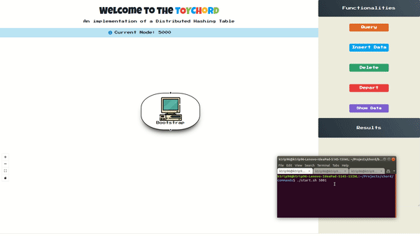

# toyChord :innocent:

This is a project assigned to us from National and Technical University of Athens.

Our goal was to implement a **file-sharing application**. 

The technologies we used: 
- **Node Js**
- **React JS**
- **Socket.io**

## Preview

## Description of project

You could briefly say that toyChord is a distributed database. :floppy_disk:

It consists of many nodes (computers throughout the internet) that communicate between each other through sockets.
Each node can:
- create server and client processes
- open socket connections
- respond to incoming queries

